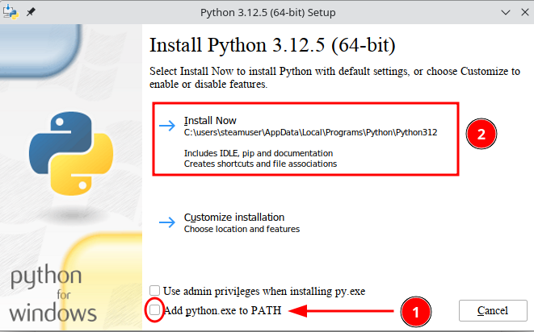

1. **Windows installatie**

    Ga naar [python site](https://www.python.org/) en download de laatste versie voor windows. Dan het gedownloade bestand uitvoeren en **BELANGRIJK**, zorg dat je op het eerste scherm de optie aanvinkt dat hij de PATH variabelen moet toevoegen!

    

    Om nu zeker te zijn dat de installatie van Python op correcte wijze gebeurd is, klik rechts op start menu en kies voor open powershell. Eenmaal dat de powershell opgestart is geef je dan het volgende commando in:

    ```
    python --version
    ```
    Bij mij krijg ik dan te zien **Python 3.12.5**. Dit is de laatste versie bij het schrijven van deze howto. Als je een fout krijgt dat hij het python commando niet vindt, dan ben je vergeten om de PATH variabel aan te vinken. Als je nu niet weet hoe je dat kan oplossen, dan is de eenvoudigste oplossing om python van je systeem te verwijderen, en opnieuw te installeren, nu met het aanvinken van de PATH variabel zoals aangeduid op de afbeelding. 

    Nu het volgende obstakel dat je kan tegenkomen. Tik in de powershell nu het commando:

    ```
    pip --version
    ```

    Bij mij wordt dit **pip 24.2 from C:\Users\serge\AppData\Local\Programs\Python\Python312\Lib\site-packages\pip (python 3.12)**. Als je nu echter een fout krijgt, dan kan jij op je computer geen scripts uitvoeren. De oplossing hiervoor is:

    - klik rechts op start menu
    - klik op instellingen
    - klik op Bijwerken en beveiliging
    - klik op Voor ontwikkelaars
    - scroll wat naar beneden tot je PowerShell ziet
    - klik op Toepassen
    - sluit het venster

    Nu zou het dan mogelijk zijn om de versie van pip op te vragen.

2. **Installatie onder linux.**

    Open een terminal en geef het volgende commando in:

    ```
    sudo apt install python3-full python3-dev python3-pip python3-venv python3-wheel python3-toml
    ```

Cheers!
