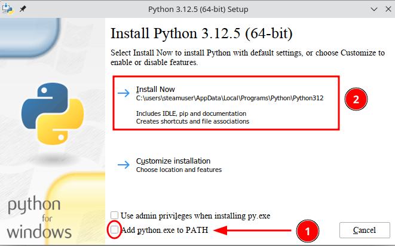

**Ontwerp mooie grafische omgevingen met QtDesigner.**

QtDesigner installeren.

QtDesigner is een GUI applicatie die je kan gebruiken met een versie van PyQt of Pyside. Pyside6 is wat ik nu gebruik, aangezien dit de laatste versie van Pyside is bij het schrijven van deze tutorial. Ik gebruik debian als mijn OS en om designer te kunnen gebruiken heb je een python omgeving nodig. Om python te installeren op een debian based OS doe je als volgt:

```
sudo apt install python3-full python3-dev python3-venv python3-wheel python3-toml
```

Onder windows ga je naar de [python site](https://www.python.org/) en download je de laatste versie voor windows. Dan het gedownloade bestand uitvoeren en **BELANGRIJK**, zorg dat je op het eerste scherm de optie aanvinkt dat hij de PATH variabelen moet toevoegen!



Onder linux open je nu een terminal en geef je volgende commando's in:

```
python3 -m venv .venv
source .venv/bin/activate
pip install pyside6
pyside6-designer
```

Onder windows open je nu een powershell. Klik rechts op het startmenu en kies powershell. Dan geef je volgende commando's in:
    
```
pip install virtualenv
python -m venv .venv
.venv/Scripts/activate
pip install pyside6
pysyde6-designer
```

Sluit nu qt-designer af en geef het commando **deactivate** om de virtuele omgeving te verlaten.

Op beide systemen heb je nu een virtuele omgeving met de naam .venv. De bedoeling is natuurlijk dat je een project gaat aanmaken en dat je de virtuele omgeving in het project gaat aanmaken. Ieder project zal dus zijn eigen virtuele omgeving hebben. Hier laat ik je gewoon zien dat je QtDesigner auto cadeau krijgt als je een virtuele omgeving aanmaakt. Je kan nu gerust die .venv folder verwijderen.

Een andere methode om QtDesigner te installeren onder Linux is via de package manager van je OS, maar beter nog, de flatpak installeren.

Mocht je nu QtCreator op je systeem hebben, kan je ook  deze gebruiken om een QtDesigner form aan te maken.

Onder windows bestaat er een standalone versie van QtDesigner welke je hier kan [downloden](https://build-system.fman.io/qt-designer-download).

Cheers!

   


   